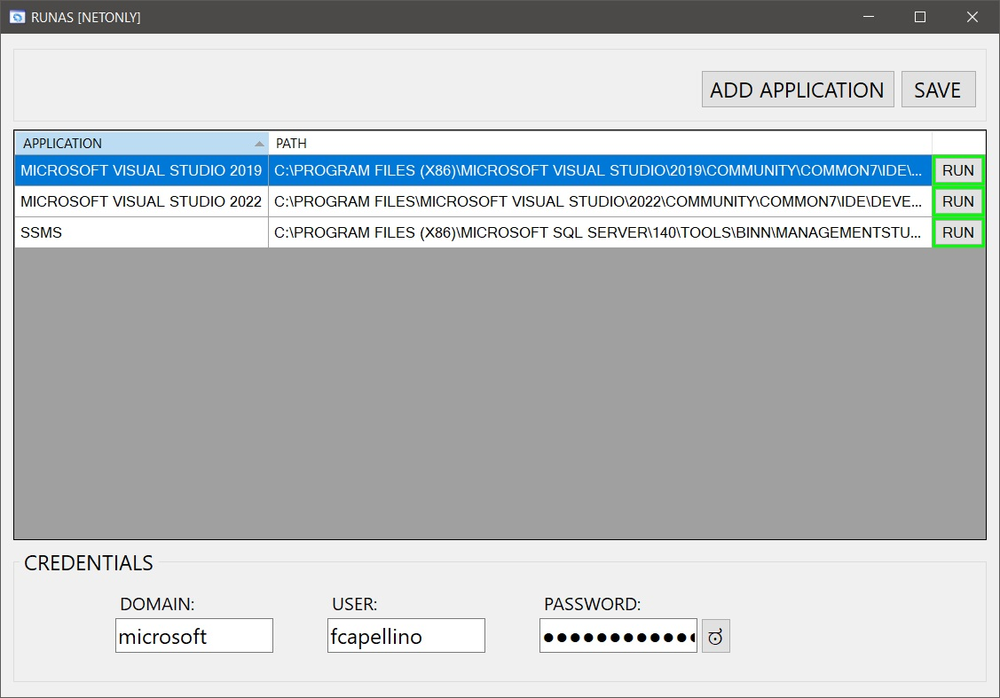
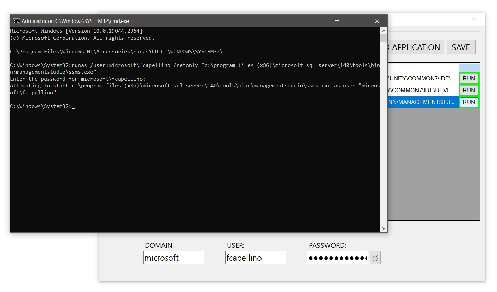

# RunAs /netonly

When you start a program with RunAs /netonly, the program will execute on your local computer as the user you are currently logged on as, but any connections to other computers on the network will be made using the user account specified.

## Screenshots

## Resources

- *[Windows Forms documentation](https://learn.microsoft.com/en-us/dotnet/desktop/winforms/)*
- *[RUNAS](https://ss64.com/nt/runas.html)*
